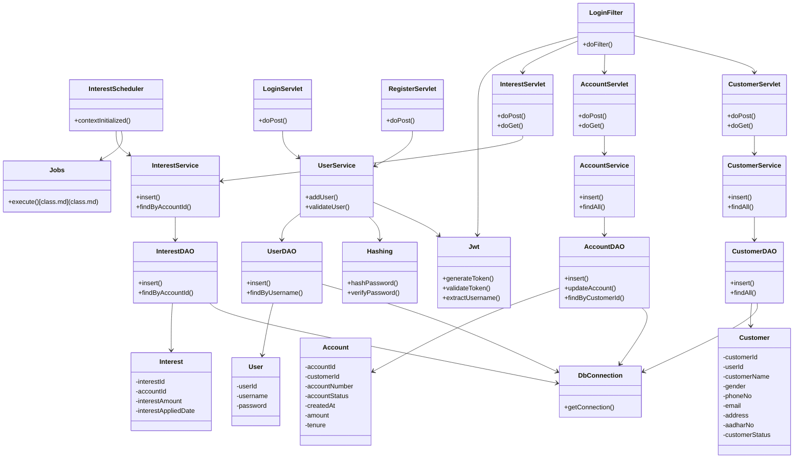

```mermaid
classDiagram

%% =========================
%% SCHEDULER
%% =========================
class InterestScheduler {
    +contextInitialized()
}

class Jobs {
    +execute()[class.md](class.md)
}

InterestScheduler --> Jobs

%% =========================
%% FILTER
%% =========================
class LoginFilter {
    +doFilter()
}

%% =========================
%% SERVLETS
%% =========================
class LoginServlet {
    +doPost()
}

class RegisterServlet {
    +doPost()
}

class CustomerServlet {
    +doPost()
    +doGet()
}

class AccountServlet {
    +doPost()
    +doGet()
}

class InterestServlet {
    +doPost()
    +doGet()
}

LoginFilter --> CustomerServlet
LoginFilter --> AccountServlet
LoginFilter --> InterestServlet

%% =========================
%% SERVICES
%% =========================
class UserService {
    +addUser()
    +validateUser()
}

class CustomerService {
    +insert()
    +findAll()
}

class AccountService {
    +insert()
    +findAll()
}

class InterestService {
    +insert()
    +findByAccountId()
}

LoginServlet --> UserService
RegisterServlet --> UserService
CustomerServlet --> CustomerService
AccountServlet --> AccountService
InterestServlet --> InterestService

InterestScheduler --> InterestService

%% =========================
%% SECURITY / UTILITY
%% =========================
class Jwt {
    +generateToken()
    +validateToken()
    +extractUsername()
}

class Hashing {
    +hashPassword()
    +verifyPassword()
}

UserService --> Jwt
UserService --> Hashing
LoginFilter --> Jwt

%% =========================
%% DAO LAYER
%% =========================
class UserDAO {
    +insert()
    +findByUsername()
}

class CustomerDAO {
    +insert()
    +findAll()
}

class AccountDAO {
    +insert()
    +updateAccount()
    +findByCustomerId()
}

class InterestDAO {
    +insert()
    +findByAccountId()
}

UserService --> UserDAO
CustomerService --> CustomerDAO
AccountService --> AccountDAO
InterestService --> InterestDAO

%% =========================
%% DB CONFIG
%% =========================
class DbConnection {
    +getConnection()
}

UserDAO --> DbConnection
CustomerDAO --> DbConnection
AccountDAO --> DbConnection
InterestDAO --> DbConnection

%% =========================
%% MODELS
%% =========================
class User {
    -userId
    -username
    -password
}

class Customer {
    -customerId
    -userId
    -customerName
    -gender
    -phoneNo
    -email
    -address
    -aadharNo
    -customerStatus
}

class Account {
    -accountId
    -customerId
    -accountNumber
    -accountStatus
    -createdAt
    -amount
    -tenure
}

class Interest {
    -interestId
    -accountId
    -interestAmount
    -interestAppliedDate
}

UserDAO --> User
CustomerDAO --> Customer
AccountDAO --> Account
InterestDAO --> Interest
```