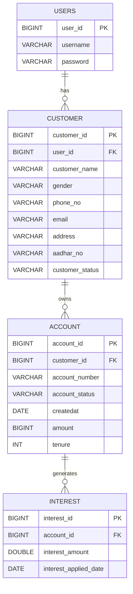

```mermaid
  erDiagram

    USERS {
        BIGINT user_id PK
        VARCHAR username
        VARCHAR password
    }

    CUSTOMER {
        BIGINT customer_id PK
        BIGINT user_id FK
        VARCHAR customer_name
        VARCHAR gender
        VARCHAR phone_no
        VARCHAR email
        VARCHAR address
        VARCHAR aadhar_no
        VARCHAR customer_status
    }

    ACCOUNT {
        BIGINT account_id PK
        BIGINT customer_id FK
        VARCHAR account_number
        VARCHAR account_status
        DATE createdat
        BIGINT amount
        INT tenure
    }

    INTEREST {
        BIGINT interest_id PK
        BIGINT account_id FK
        DOUBLE interest_amount
        DATE interest_applied_date
    }

    USERS ||--o{ CUSTOMER : has
    CUSTOMER ||--o{ ACCOUNT : owns
    ACCOUNT ||--o{ INTEREST : generates
```