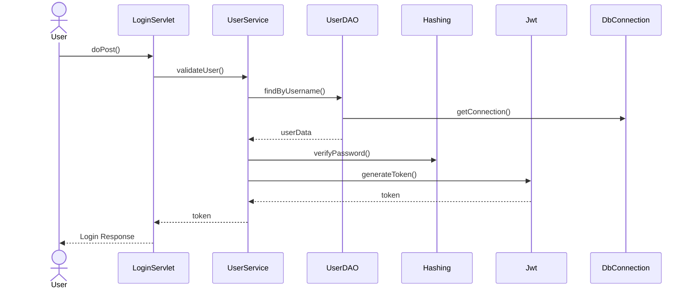

```mermaid
sequenceDiagram
actor User
participant LoginServlet
participant UserService
participant UserDAO
participant Hashing
participant Jwt
participant DbConnection

User ->> LoginServlet: doPost()
LoginServlet ->> UserService: validateUser()
UserService ->> UserDAO: findByUsername()
UserDAO ->> DbConnection: getConnection()
UserDAO -->> UserService: userData
UserService ->> Hashing: verifyPassword()
UserService ->> Jwt: generateToken()
Jwt -->> UserService: token
UserService -->> LoginServlet: token
LoginServlet -->> User: Login Response
```