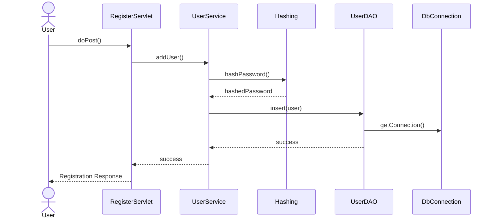

```mermaid
sequenceDiagram
actor User
participant RegisterServlet
participant UserService
participant Hashing
participant UserDAO
participant DbConnection

User ->> RegisterServlet: doPost()
RegisterServlet ->> UserService: addUser()
UserService ->> Hashing: hashPassword()
Hashing -->> UserService: hashedPassword
UserService ->> UserDAO: insert(user)
UserDAO ->> DbConnection: getConnection()
UserDAO -->> UserService: success
UserService -->> RegisterServlet: success
RegisterServlet -->> User: Registration Response
```